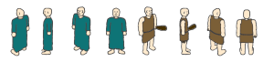
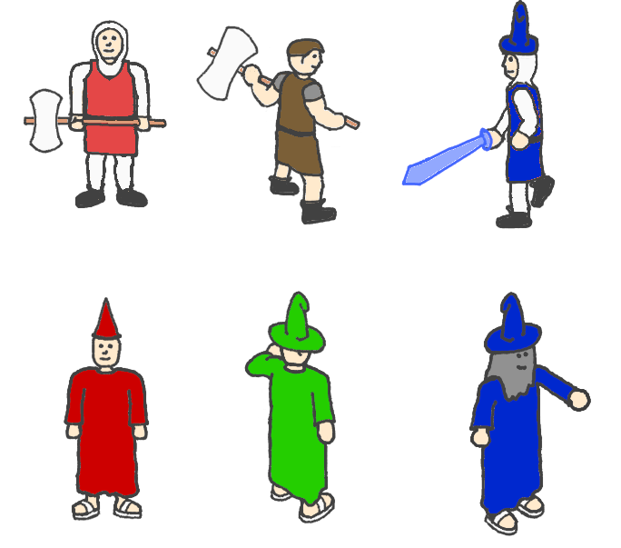
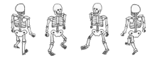
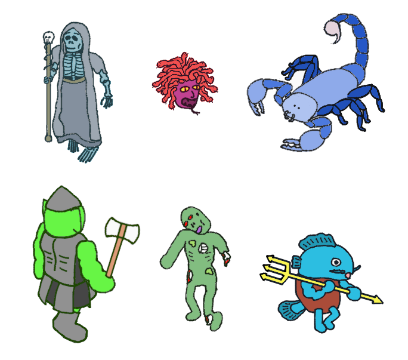
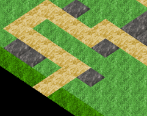
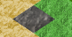
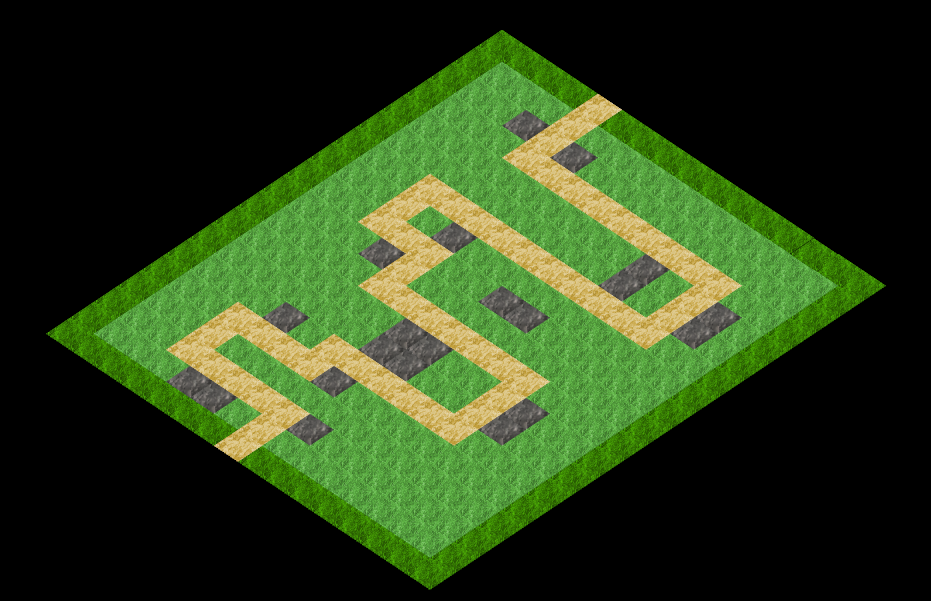

 
 
 
 
 
 
 
 
 
 
<h1 align="center"><b>Defenders of Ragnar</b></h1>
<h4 align="center">A Game by Marc-Andre Michaud</h4>
<h4 align="center">Student, Gaming Experience Development Sr</h4>
<h4 align="center">PROG1189: Comprehensive Development Project</h4>
<h4 align="center">New Brunswick Community College</h4>
<h4 align="center">School of Information Technology and Natural Resources</h4>
 
 
 
 
 
 
<h4 align="center">April 14th, 2022</h4>
<h4 align="center">Made using the SFML Game Development game engine</h4>
 
 
 
 
 
 
 
 

<h1 align="center"><b>Executive Summary</b></h1>
 

Defenders of Ragnar is a stategic Tower Defence game, roughly based on UO:Defender, which is itself based on Ultima Online.

 
 

The game uses a top-down isometric tile-based view with 2D animated sprites for towers and enemies.
The mouse will be the main input method, with a few keyboard shortcuts.

 
 

The main objective of the game is placing "towers" that will attack enemies coming down a path to stop them from coming through.
Success is achieved by proper strategic placement of towers, and the game is lost by having too many enemies make it through the game area.

 
 
 
 

<h1 align="center"><b>Overview</b></h1>
 

King Ragnar II has tasked you with defending the his kingdom of Elion. You will travel the realm defending it from would-be invaders. 
The King's warriors and wizards will be at your disposal.

 
 

Each location will offer finite waves of invaders which you must stop from crossing into the inner kingdom.
Each enemy slain will earn you gold to hire and upgrade your towers (warriors and wizards.)

 
 
 
 

<h1 align="center"><b>The Quest</b></h1>
 

The player starts a level with 30 lives. Each time an enemy reaches the end of the game board the player loses a life. At 0 lives the game is lost.

 
 

Each level has predefined "waves" of enemies dictating enemy types and spawn frequency. A level is won by successfully surviving the final wave which is usually a boss wave.

 
 

Throughout the level, the player earns gold for purchasing and upgrading towers by killing enemies.

 
 
 
 

<h1 align="center"><b>Protagonists</b></h1>
 

  

The "Towers" in this game will be represented as warriors and wizards of various kinds. 
The player can place base type warriors and wizards, these towers can branch into various types with special attributes.
Warrior towers have an attack range of only one tile, while wizards have a longer range with lower DPS.

 
 

Each tower will require a combination of gold and experience points from slaying enemies in order to be upgraded.

 
 

Once upgraded, wizard towers will start using elemental spells. Each element has its own special properties.
Energy has high DPS and range. Fire has Area of Effect. Ice slows enemies down, and Poison does damage over time.

 
 

After progressing through a level, the player can unlock prestige class towers which offer a mix of benefits from warrior and wizard towers at a higher price.

 
 
 
 

<h1 align="center"><b>Sketch of Protagonists</b></h1>

  

 
 

<h1 align="center"><b>Antagonists</b></h1>
 

  

Each level has a specific theme which dictates the types of enemies confronting the player. 
These enemies will attempt to make their way across the game board. If too many enemies make it through, the player loses.

 
 

Every level will have a predefined set of enemy waves based on enemy type, amount, and spawn frequency.

 
 

Some enemies will challenge the player with faster movement speed, higher health, or fast spawning.

 
 

Each level will have boss waves which feature a single enemy that is extra hard to kill.

 
 
 
 

<h1 align="center"><b>Sketch of Antagonists</b></h1>

  

 
 

<h1 align="center"><b>Environment</b></h1>
 

The game environment consists of an isometric tiled game board. Each level has at least one path for enemies to travel. 
Enemies enter the level at the upper right edge, and make their way to their exit on the lower left edge.

Enemy paths are indicated by dirt tiles. The paths are deliberately circuitous to offer the player ample opportunity to attack enemies making their way across the board.
The first level has a single dirt path while later levels have multiple paths.

Towers may only be placed on stone tiles. This puts strategic constraints on the player.
Warrior towers perform better on stones with many adjacent path tiles whereas wizards can take advantage of tiles from a longer range.

 
 
 
 

<h1 align="center"><b>Sketch of World</b></h1>

  

 
 

<h1 align="center"><b>Menus</b></h1>
 

The game will have a start menu, a pause menu, and some basic UI buttons in the main game view.

 
 

The start menu will include level selection, options, and an exit button to leave the game.

 
 

The pause menu will have an option to resume the game, and another to return to the start menu.

 
 

The in-game UI will have buttons for tower selection, round start, and music/sound volume settings.

 
 
 
 

<h1 align="center"><b>Controls</b></h1>
 

The mouse will be the main source of input for this game. Mousing over the board will highlight the tiles being moused over.
When placing or interacting with a tower, the tiles within the tower's attack range will be highlighted.

 
 

Keyboard hotkeys will also be available. Esc will cancel tower placement, P will pause the game, and M/S will adjust music and sound settings.

 
 
 
 

<h1 align="center"><b>Sounds</b></h1>
 

The game will have menu music and in-game music.

 
 

In adition to music, There will be sound effects for the various tower attacks.

 
 
 
 

<h1 align="center"><b>Summary</b></h1>
 

This game should appeal to strategic minded players whlie maintaining a simplicity that makes it accessible to casual gamers.

 
 

Randomness in enemy spawn patterns and multiple branching tower upgrade paths will offer replay value.

 
 

Furthermore, adding additional content and features should be relatively simple. If the game is successful,
additional levels can easily be added to extend the game.

 
 
 
 
